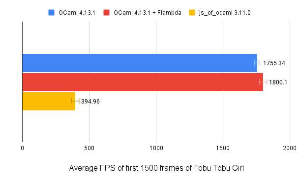

[](https://github.com/linoscope/CAMLBOY/actions/workflows/workflow.yml)
[](https://opensource.org/licenses/MIT)

<p align="center">
  
</p>

## About

**_CAMLBOY_** is a Game Boy emulator that runs in the browser. It is written in [OCaml](https://ocaml.org/) and compiled to JavaScript using [js_of_ocaml](http://ocsigen.org/js_of_ocaml/latest/manual/overview).

Try it out in our **[demo page](https://linoscope.github.io/CAMLBOY/)**!

## Screenshot

<div align="center">
  
</div>

## Project goals and non-goals

### Goals

- Playable in the browser of your phone
- Readable/maintainable code that follow OCaml's best practices
- Minimal external dependecies in the core emulator code (`/lib`) in order to support various compiler backends

### Stretch goals

- Achive stable 60fps in low-tier mobile devices
- Serve as a benchmark target for various compile backends, similar to [optcarrot](https://github.com/mame/optcarrot) in the Ruby world
  - Would be especially interesting if we can compare the performance of various JS/wasm backends, such as [js_of_ocaml](http://ocsigen.org/js_of_ocaml/latest/manual/overview), [Rescript](https://rescript-lang.org/), [Melange](https://github.com/melange-re/melange), and [ocaml-wasm](https://github.com/corwin-of-amber/ocaml-wasm/tree/wasm-4.11)

### Non-goals

- Run all games with high accuracy
- Optimize performance to the limit at the expese of code readability

## Current state

- Runs with "playable" FPS in middle-tier mobile devices. (It runs at around 40~60FPS in my Galaxy S9, a smartphone released in 2018)
- Supports "headless" benchmarking mode (for both native and web) that runs without rendering the screen
- Passes various test roms: [tests for Blargg's test roms](https://github.com/linoscope/CAMLBOY/blob/main/test/rom_tests/test_blargg_test_roms.ml), [tests for Mooneye's test roms](https://github.com/linoscope/CAMLBOY/tree/main/test/rom_tests/mooneye)

## Benchmark results

We ran the first 1500 frames of [Tobu Tobu Girl](https://tangramgames.dk/tobutobugirl/) in "headless" mode (i.e. without UI) for 10 times each and calculated the average FPS. The error bars represent the standard deviation. See [`benchmark.md`](benchmark.md) for details about the environment / commands used for the benchmark.



## How to run

### Prerequisite

Install [opam](https://opam.ocaml.org/doc/Install.html), OCaml's package manager, if you haven't yet.

### Basic setup

```sh
# Clone repository
git clone https://github.com/linoscope/CAMLBOY.git
# cd into repository
cd CAMLBOY
# Craete local switch for the repository
opam switch create . 4.13.1
eval $(opam env)
# Install system packages required by opam packages (SDL, etc)
opam pin add camlboy.dev . --no-action
opam depext camlboy
# Install opam dependencies
opam install . --deps-only --with-test
```

### How to run with UI

#### js_of_ocaml frontend

```sh
# Build
$ dune build
# Serve `_build/default/bin/web` using some server. For example, run the following with python:
$ python -m http.server 8000 --directory _build/default/bin/web
# Now open `localhost:8000` in the browser

```

#### SDL2 frontend

```sh
# Build
$ dune build
# Usage: main.exe [--mode {default|withtrace|no-throttle}] <rom_path>
# For example:
$ dune exec bin/sdl2/main.exe -- resource/games/tobu.gb
```

### How to run bench marks in headless mode

#### Benchmark for js_of_ocaml build

First, follow the steps in "How to run with UI - js_of_ocaml frontend" above. Now open `http://localhost:8000/bench.html?frames=<frames>&rom_path=<rom_path>`. For example, if you open [http://localhost:8000/bench.html?frames=1500&rom_path=./tobu.gb](http://localhost:8000/bench.html?frames=1500&rom_path=./tobu.gb) you should see something like this:


#### Benchmark for native

```sh
# Usage: bench.exe [--frames <frames>] <rom_path>
# For example:
$ dune exec bin/sdl2/bench.exe -- resource/games/tobu.gb --frames 1500
ROM path: resource/games/tobu.gb
  Frames: 1500
Duration: 1.453315
     FPS: 1032.123098
```

### How to run tests

```sh
# Run all tests:
$ dune runtest
# Run unit tests only:
$ dune runtest test/unit_tests/
# Run integration tests (tests that use test roms):
$ dune runtest test/rom_tests/
```

## Project Structure

- `lib` - Main emulator code
- `bin` - UI code
  - `web` - Web
  - `sdl2` - SDL2
- `test`
  - `unit_tests` - Unit tests
  - `rom_tests` - Integration tests that use test roms
- `resource`
  - `games` - Game roms
  - `test_roms` - Test roms used in `rom_tests`

## TODO

- [ ] Cartridge based save
- [ ] Audio Processing Unit (APU)
- [ ] Rescript backend
- [ ] MBC5
- [ ] Game Boy Color mode

## Resources

- [Pandocs](https://gbdev.io/pandocs/)
- [Game Boy CPU Manual](http://marc.rawer.de/Gameboy/Docs/GBCPUman.pdf)
- [gbops](https://izik1.github.io/gbops/)
- [GBEDG](https://hacktixme.ga/GBEDG/)
- [Imran Nazar's blog](https://imrannazar.com/GameBoy-Emulation-in-JavaScript)
- [codeslinger.co.uk](http://www.codeslinger.co.uk/pages/projects/gameboy.html)

## Source of built-in game ROMs:

- [The Bouncing Ball](https://gamejolt.com/games/the-bouncing-ball-gb/86699)
- [Tobu Tobu Girl](https://tangramgames.dk/tobutobugirl/)
- [Retroid](https://the-green-screen.com/292-2/#welcome)
- [Into The Blue](https://the-green-screen.com/278-2/#welcome)
- [Wishing Sarah](https://asteristic.itch.io/wishing-sarah)
- [Rocket Man Demo](https://lightgamesgb.com/portfolio/rocket-man/)
- [SHEET IT UP](https://drludos.itch.io/sheep-it-up)
- [Cavern](https://thegreatgallus.itch.io/cavern-mvm-9)

## More screenshots

<div align="center">
    
    
    
    
</div>
